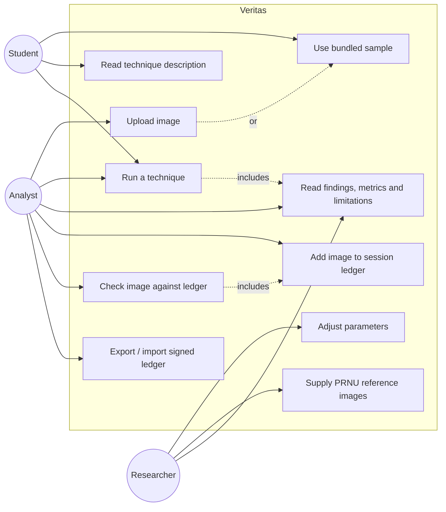
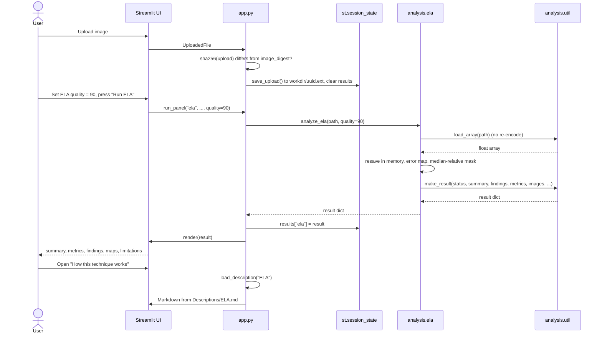
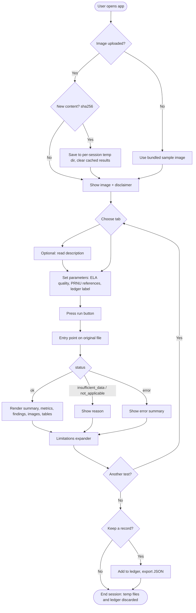
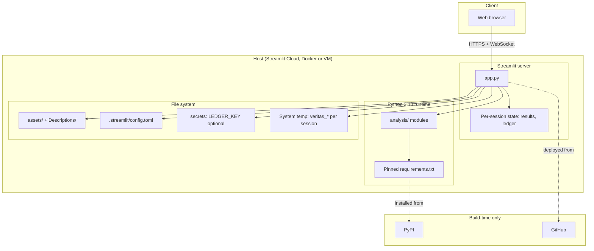

# Project Documentation Report

 
 
 
 
 

# Veritas Forensics

## Digital Image Forensic Analysis Toolkit

 
 

**Author:**  
Rafay Adeel

**Version:** 3.0.0 (September 2026)

 
 
 
 

## 2. Table of Contents

1. [Title Page](#project-documentation-report)
2. [Table of Contents](#2-table-of-contents)
3. [Introduction](#3-introduction)
4. [Purpose of the Project](#4-purpose-of-the-project)
5. [Problem Statement](#5-problem-statement)
6. [Objectives](#6-objectives)
7. [Scope of the Project](#7-scope-of-the-project)
8. [Literature Review](#8-literature-review)
9. [System Requirements](#9-system-requirements)
10. [Functional Requirements](#10-functional-requirements)
11. [Non-Functional Requirements](#11-non-functional-requirements)
12. [Hardware and Software Requirements](#12-hardware-and-software-requirements)
13. [System Design](#13-system-design)
14. [UML Diagrams](#14-uml-diagrams)
    - [System Architecture Diagram](#141-system-architecture-diagram)
    - [Use Case Diagram](#142-use-case-diagram)
    - [Sequence Diagram](#143-sequence-diagram)
    - [Class Diagram](#144-class-diagram)
    - [Activity Diagram](#145-activity-diagram)
    - [Component Diagram](#146-component-diagram)
    - [Deployment Diagram](#147-deployment-diagram)
15. [Implementation Details](#15-implementation-details)
16. [Development Tools and Technologies](#16-development-tools-and-technologies)
17. [Programming Languages and Frameworks](#17-programming-languages-and-frameworks)
18. [Testing Strategy](#18-testing-strategy)
19. [Results and Discussion](#19-results-and-discussion)
20. [Conclusion](#20-conclusion)

## 3. Introduction

The credibility of digital imagery matters in journalism, investigations and
everyday social-media use. Editing tools and generative models make visual
inspection inadequate, and **digital image forensics** studies the traces
that capture, compression and editing leave in an image file.

**Veritas Forensics** is a toolkit, begun as a semester project, that puts a
set of published forensic techniques behind one Streamlit web interface.
Version 3.0.0 rebuilt every technique on a published method with thresholds
calibrated on seeded synthetic benchmarks. This report documents the
motivation, design and implementation.

> Every result the toolkit shows is an **indicator, not proof**. It reports
> what each test measured; it never certifies an image as unedited.

## 4. Purpose of the Project

Veritas supports **semi-automated forensic screening** of single images.
Rather than replacing experts, it:

- visualises traces that are hard to see (error levels, noise levels,
  duplicated regions, compression grids);
- offers several independent forensic perspectives on the same image;
- serves as an educational resource, with an in-app guide per technique
  that states the method, the measured detection and false-alarm rates, and
  the limitations.

## 5. Problem Statement

> **How can a unified, intuitive platform let users run several published
> image-forensics techniques without deep expertise, while being honest about
> what each result can and cannot show?**

Challenges:

1. **Fragmentation**: many algorithms exist only as research code.
2. **Usability**: raw numbers are hard to interpret without guidance.
3. **Overclaiming**: forensic tools are easily read as verdicts. A single
   "authenticity score" hides that each test sees only one kind of trace.

## 6. Objectives

1. **Integration**: combine compression, metadata/provenance, pixel-statistic,
   geometric, sensor and steganalysis techniques in one Streamlit app.
2. **Usability**: a first-time user can run an analysis within a minute (a
   sample image is preloaded).
3. **Education**: an in-app description per technique (`Descriptions/`).
4. **Rigour**: each technique implements a published method; each decision
   threshold is calibrated on a seeded benchmark to a stated false-alarm rate.
5. **Honesty**: report measurements and "inconsistency found / not found",
   never "authentic".

## 7. Scope of the Project

**Included**

- Static **JPEG and PNG** images (the uploader accepts `.jpg`, `.jpeg`, `.png`).
- Thirteen tabs: ELA, Metadata & C2PA, Histogram, Noise, JPEG (quantization
  tables, double-JPEG, ghosts), Copy-Move, PRNU, Frequency (spectrum, block
  grid), Resampling, Synthetic traces (Experimental), Steganography, Hash
  ledger, About.
- A per-session hash ledger with signed export/import.

**Excluded**

- Video and audio forensics.
- Trained deep-learning detectors (the synthetic-traces tab is a fixed
  spectral measurement with no verdict).
- Case management, trusted timestamping and legal chain of custody.

## 8. Literature Review

1. **JPEG compression.** Krawetz (2007) introduced Error Level Analysis.
   Farid (2009) showed that recompressing at a range of qualities exposes
   regions previously compressed at a lower quality ("JPEG ghosts"). Bianchi &
   Piva (2012) model DCT coefficient histograms of doubly compressed JPEGs to
   localize singly compressed (pasted) blocks. Li, Yuan & Yu (2009) extract
   the 8×8 block artifact grid, whose misalignment reveals cropping or pasted
   JPEG regions.
2. **Resampling.** Popescu & Farid (2005) and Kirchner (2008) showed that
   interpolation leaves periodic correlations; Kirchner's fixed linear
   predictor makes detection fast, and Kirchner & Gloe (2009) handle the JPEG
   peaks that otherwise mimic resampling.
3. **Copy-move.** Amerini et al. (2011, 2013) match SIFT keypoints within an
   image and fit affine transforms; Cozzolino, Poggi & Verdoliva (2015) use a
   dense PatchMatch field over rotation-invariant Zernike features.
4. **Noise and sensor fingerprints.** Lukáš, Fridrich & Goljan (2006)
   introduced PRNU camera identification; Chen et al. (2008) added a
   correlation predictor for integrity checking and Goljan et al. (2009) the
   PCE statistic; Chierchia et al. (2014) localise splices with an MRF.
   Cozzolino, Poggi & Verdoliva (2015, Splicebuster) expose splices from
   inconsistent noise-residual co-occurrence statistics.
5. **Pixel statistics.** Stamm & Liu (2010) detect contrast enhancement from
   the histogram's high-frequency energy.
6. **Metadata and provenance.** Kee, Johnson & Farid (2011) used JPEG headers
   to identify the last encoder. The C2PA standard (2.x) adds signed
   Content Credentials, the only cryptographic provenance signal the toolkit
   reads.
7. **Steganalysis.** Westfeld & Pfitzmann (1999), Fridrich et al. (2001),
   Dumitrescu et al. (2003) and Ker & Böhme (2008) give statistical and
   quantitative LSB-replacement detectors.
8. **Synthetic images.** Durall et al. (2020) and Corvi et al. (2023) report
   spectral peaks left by generator upsampling; modern generators and
   post-processing often remove them.
9. **Surveys** (Farid 2016; Stamm, Wu & Liu 2013; Verdoliva 2020) stress that
   no single technique is reliable alone, which motivates the multi-module
   design and the absence of a combined score.

## 9. System Requirements

- **OS**: Windows 10/11, macOS or a modern Linux distribution.
- **Python**: 3.10 (pinned in `.python-version`).
- **Libraries** (pinned in `requirements.txt`): `streamlit`, `numpy`,
  `scipy`, `scikit-image`, `opencv-python-headless`, `Pillow`, `PyWavelets`,
  `matplotlib`, `piexif`, `ImageHash`, `c2pa-python`.

Network access is needed only to install packages or deploy. C2PA reading
runs offline (no remote manifest or OCSP fetches).

## 10. Functional Requirements

1. **FR-01 Image ingestion**: upload a JPEG or PNG through the sidebar.
2. **FR-02 Sample image**: load the bundled sample automatically when nothing
   is uploaded (a known fabricated example).
3. **FR-03 Technique navigation**: one tab per technique.
4. **FR-04 Parameters**: ELA recompression quality slider (50–95); PRNU
   reference-image upload; ledger label and note.
5. **FR-05 Results**: every analysis shows a summary, metrics, findings
   (info / notice / warning), images, tables and its limitations.
6. **FR-06 Descriptions**: a "How this technique works" expander per tab,
   loaded from `Descriptions/`.
7. **FR-07 Ledger**: add the current image, check it against the session
   ledger, export (signed when `LEDGER_KEY` is set) and import ledgers.
8. **FR-08 Disclaimer**: an "indicators, not proof" notice on every page.

## 11. Non-Functional Requirements

1. **NFR-01 Fidelity**: analyses read the original file bytes; no re-encoding
   before analysis.
2. **NFR-02 Privacy**: uploads are stored in a per-session temporary
   directory with random names; the ledger is per session.
3. **NFR-03 Reliability**: analysis functions never raise; failures,
   too-small and wrong-format inputs are reported as `error`,
   `insufficient_data` or `not_applicable`.
4. **NFR-04 Maintainability**: one module per technique, one shared result
   contract, one renderer.
5. **NFR-05 Calibration**: decision thresholds carry their measured
   false-alarm rate.
6. **NFR-06 Portability**: installable from one pinned `requirements.txt`.

## 12. Hardware and Software Requirements

**Hardware**: dual-core CPU, 4 GB RAM (8 GB recommended for large images),
1 GB disk for the environment.

**Software**: Python 3.10, `pip`, a modern browser; optionally an editor such
as VS Code.

## 13. System Design

1. **Presentation layer** — `app.py` (Streamlit): sidebar upload, 13 tabs,
   `render(result)` for every analysis, `describe(name)` for the guides.
2. **Application logic** — `run_panel` (button, call, cache in
   `st.session_state.results`, render), per-session `workdir()`, the ledger
   in `st.session_state.ledger`, `LEDGER_KEY` from `st.secrets`.
3. **Analysis layer** — `analysis/<module>.py`, one pure entry point per
   technique returning the result contract of `analysis/util.py`.
4. **Resources** — `assets/` (sample image, CSS) and `Descriptions/`.

Flow: user uploads or uses the sample → the file is saved to the session
directory → the user presses a tab's button → `run_panel` calls the entry
point with the file path → the module decodes the original bytes, measures,
and returns a result dict → `render` displays it.

## 14. UML Diagrams

### 14.1. System Architecture Diagram

```mermaid
graph TB
    subgraph "Presentation Layer (app.py)"
        Upload[Sidebar file_uploader]
        Tabs[13 tabs]
        Render[render result]
        Describe[describe - Descriptions expander]
        Disclaimer[Indicators, not proof notice]
    end

    subgraph "Application Logic (app.py)"
        RunPanel[run_panel: button + cache]
        Session[st.session_state: workdir, results, ledger]
        Secrets[st.secrets LEDGER_KEY]
    end

    subgraph "Analysis Layer (analysis/)"
        ELA[ela.analyze_ela]
        META[metadata_analysis.analyze_metadata]
        HIST[histogram_analysis.analyze_histogram]
        NOISE[noise_map.analyze_noise]
        QUANT[quant_table.analyze_quantization_table]
        DJPEG[double_jpeg.analyze_double_jpeg]
        GHOST[jpeg_ghost.analyze_jpeg_ghost]
        CMFD[cmfd.detect_copy_move]
        PRNU[prnu.analyze_prnu]
        FREQ[frequency_analysis.analyze_spectrum / analyze_blocking]
        RESAMP[resampling_detector.detect_resampling]
        SYN[deepfake_detector.analyze_synthetic_traces]
        STEGO[steganography_detection.analyze_lsb]
        HASH[hash_verification ledger functions]
        UTIL[util: make_result, load_array, BAG grid]
    end

    subgraph "Resources"
        Assets[assets/ sample image]
        Desc[Descriptions/*.md]
        Temp[per-session temp dir]
    end

    Upload --> Session
    Session --> Temp
    Tabs --> RunPanel
    RunPanel --> ELA & META & HIST & NOISE & QUANT & DJPEG & GHOST
    RunPanel --> CMFD & PRNU & FREQ & RESAMP & SYN & STEGO & HASH
    ELA & META & HIST & NOISE & QUANT & DJPEG & GHOST --> UTIL
    CMFD & PRNU & FREQ & RESAMP & SYN & STEGO & HASH --> UTIL
    RunPanel --> Session
    RunPanel --> Render
    Secrets --> HASH
    Describe --> Desc
    Session --> Assets
```

### 14.2. Use Case Diagram

### 14.3. Sequence Diagram

### 14.4. Class Diagram

The modules are function-based; each box is a module with its public
functions.

```mermaid
classDiagram
    class app_py {
        +workdir()
        +save_upload(uploaded, subdir)
        +load_description(name)
        +render(result)
        +run_panel(key, label, fn, *args, **kwargs)
        +describe(name)
    }
    class util {
        +STATUSES
        +LEVELS
        +make_result(status, summary, findings, metrics, images, tables, limitations, details)
        +error_result(exc, limitations)
        +load_array(path, mode, max_px)
        +to_uint8(arr, stretch)
        +overlay_mask(rgb, mask, color, alpha)
        +jpeg_grid_offset(gray)
    }
    class ela { +analyze_ela(path, quality=90) }
    class metadata_analysis { +analyze_metadata(path) +read_c2pa(path) }
    class histogram_analysis { +analyze_histogram(path) }
    class noise_map { +analyze_noise(path) }
    class quant_table {
        +analyze_quantization_table(path)
        +extract_jpeg_quantization_tables(path)
        +estimate_jpeg_quality(qtable, table_id)
        +is_standard_table(qtable, table_id, tolerance)
    }
    class double_jpeg { +analyze_double_jpeg(path) }
    class jpeg_ghost { +analyze_jpeg_ghost(path, qualities) }
    class cmfd { +detect_copy_move(path, max_px=2048) }
    class prnu { +analyze_prnu(path, reference_paths, max_px=2048) }
    class frequency_analysis { +analyze_spectrum(path) +analyze_blocking(path) }
    class resampling_detector { +detect_resampling(path) }
    class deepfake_detector { +analyze_synthetic_traces(path) }
    class steganography_detection { +analyze_lsb(path) }
    class hash_verification {
        +compute_hashes(path)
        +new_ledger()
        +add_record(ledger, path, label, note)
        +verify_chain(ledger)
        +verify_image(ledger, path, threshold)
        +export_ledger(ledger, key)
        +import_ledger(data, key, into)
        +ledger_stats(ledger)
    }

    app_py --> ela
    app_py --> metadata_analysis
    app_py --> histogram_analysis
    app_py --> noise_map
    app_py --> quant_table
    app_py --> double_jpeg
    app_py --> jpeg_ghost
    app_py --> cmfd
    app_py --> prnu
    app_py --> frequency_analysis
    app_py --> resampling_detector
    app_py --> deepfake_detector
    app_py --> steganography_detection
    app_py --> hash_verification
    app_py --> util : error_result
    double_jpeg --> quant_table : Q table, quality
    jpeg_ghost --> quant_table : primary quality
    deepfake_detector --> prnu : noise_extract
    ela ..> util
    cmfd ..> util
    frequency_analysis ..> util : BAG grid
    resampling_detector ..> util : grid strength
```

### 14.5. Activity Diagram

### 14.6. Component Diagram

```mermaid
graph TB
    subgraph "Frontend (Streamlit)"
        Uploader[file_uploader]
        TabBar[st.tabs x13]
        Metrics[st.metric / st.image / st.dataframe]
        Expanders[Descriptions, Limitations, Raw values]
    end

    subgraph "Core (app.py)"
        RunPanel[run_panel]
        Renderer[render]
        SessionState[session_state]
    end

    subgraph "Analysis components"
        subgraph "Compression"
            ELAc[ELA]
            QTc[Quantization tables]
            DJc[Double-JPEG]
            GHc[JPEG ghosts]
            BAGc[Block grid]
        end
        subgraph "Content & statistics"
            HISTc[Histogram]
            NOISEc[Noise]
            SPECc[Spectrum]
            CMFDc[Copy-move]
            RESc[Resampling]
            SYNc[Synthetic traces - Experimental]
            STEGc[LSB steganalysis]
        end
        subgraph "Source & provenance"
            METAc[Metadata + C2PA]
            PRNUc[PRNU]
            HASHc[Hash ledger]
        end
    end

    subgraph "Shared"
        Contract[util.make_result]
        Decode[util.load_array]
        Grid[util BAG helpers]
    end

    subgraph "Libraries"
        NumPy[NumPy / SciPy / scikit-image]
        OpenCV[OpenCV]
        Pillow[Pillow / piexif]
        PyWavelets[PyWavelets]
        Matplotlib[Matplotlib]
        ImageHash[ImageHash]
        C2PA[c2pa-python]
    end

    Uploader --> SessionState
    TabBar --> RunPanel
    RunPanel --> Renderer
    Renderer --> Metrics
    Renderer --> Expanders
    RunPanel --> ELAc & QTc & DJc & GHc & BAGc & HISTc & NOISEc & SPECc
    RunPanel --> CMFDc & RESc & SYNc & STEGc & METAc & PRNUc & HASHc
    ELAc & HISTc & NOISEc & CMFDc & PRNUc & SPECc & RESc & SYNc & STEGc --> Decode
    BAGc & RESc & SYNc --> Grid
    ELAc & QTc & DJc & GHc & BAGc & HISTc & NOISEc & SPECc --> Contract
    CMFDc & RESc & SYNc & STEGc & METAc & PRNUc & HASHc --> Contract
    CMFDc --> OpenCV
    PRNUc --> PyWavelets
    NOISEc --> PyWavelets
    METAc --> C2PA
    HASHc --> ImageHash
```

### 14.7. Deployment Diagram

## 15. Implementation Details

- **Decoding**: `util.load_array` decodes with Pillow to a float array
  without re-encoding and without applying EXIF orientation (compression
  grids, PRNU and CFA traces live in the stored pixel order). JPEG-specific
  modules read the quantization tables through Pillow's decoder.
- **Result contract**: every entry point returns `util.make_result(...)`;
  images are uint8 arrays (matplotlib figures are rasterised in memory with
  `fig_to_array`). See [API.md](API.md).
- **Large images**: copy-move downscales in memory to 2048 px (reported);
  PRNU, the power spectrum and the synthetic-traces analysis crop instead of
  resizing, because resizing creates or destroys the traces they measure.
- **Calibration**: decision constants sit at the top of each module with a
  comment citing the seeded benchmark that set them. The measured detection
  and false-alarm rates are in each `Descriptions/*.md`.
- **Ledger**: records are hash-chained (`prev_hash` → `record_hash`); exports
  are signed with HMAC-SHA256 when the server has `LEDGER_KEY`, otherwise
  carry a plain SHA-256 digest.
- **Technique descriptions**: `describe(name)` renders
  `Descriptions/<name>.md` in an expander at the top of each tab.

Per-technique method summaries: [TECHNIQUES.md](TECHNIQUES.md).

## 16. Development Tools and Technologies

- **Version control**: Git / GitHub.
- **Editor**: Visual Studio Code.
- **Environment**: `venv` with pinned `requirements.txt`.
- **Testing**: standard-library `unittest`
  (`python -m unittest discover -s tests -t .`).
- **Optional**: `pre-commit`, black, isort, flake8 (`requirements-dev.txt`).

## 17. Programming Languages and Frameworks

- **Python 3.10** for everything.
- **Streamlit** for the web interface.
- **NumPy / SciPy / scikit-image / PyWavelets** for signal processing,
  wavelets and statistics.
- **OpenCV** for SIFT, RANSAC and warping (copy-move).
- **Pillow / piexif** for decoding, EXIF and quantization tables;
  **c2pa-python** for Content Credentials; **ImageHash** for perceptual
  hashes.
- **Matplotlib** for plots, rasterised to arrays.

## 18. Testing Strategy

126 automated tests:

1. **Contract tests** (`tests/test_contract.py`): every entry point on JPEG,
   PNG, grayscale, RGBA, palette, 16×16, 1×1 and flat inputs must return the
   contract without raising; tiny and flat inputs must not look clean;
   overclaiming words ("authentic", "admissible", "proves", "no
   manipulation") are rejected.
2. **Per-module tests** (`tests/test_<module>.py`): behaviour on controlled
   inputs plus seeded synthetic benchmarks (e.g. splices at several JPEG
   qualities, clones at arbitrary offsets/rotations, rescaled regions, LSB
   payloads, synthetic PRNU) asserting a minimum detection rate and a
   maximum false-alarm rate.
3. **Manual system testing**: `streamlit run app.py`, every tab on the sample
   and on one fixture per case; two browser sessions uploading the same file
   name must not see each other's files or ledger.

## 19. Results and Discussion

- **Coverage**: all thirteen tabs run through one renderer; tab/module key
  mismatches, which broke several tabs before 3.0.0, can no longer occur.
- **Measured performance**: each technique's detection and false-alarm rates
  on its seeded benchmark are stated in its Description rather than claimed
  in general terms. Rates vary strongly with JPEG quality, region size and
  post-processing.
- **Sample image**: the bundled image is a known fabricated example (C2PA
  declares `compositeWithTrainedAlgorithmicMedia`, copy-moved clouds, stale
  EXIF thumbnail); Metadata, Copy-Move and several JPEG tabs report findings
  on it.

Limitations:

- The toolkit does not classify images as edited or unedited; it reports
  indicators for human interpretation.
- Benchmarks are synthetic; no evaluation on public forensic datasets is
  included.
- Resizing, strong recompression and format conversion remove most traces.
- The synthetic-traces tab cannot identify AI-generated images.

Veritas is suited to **screening and teaching**; high-stakes work needs
specialised tools, provenance data and expert review.

## 20. Conclusion

Veritas shows that an open-source toolkit can make published image-forensics
methods accessible while being explicit about what each one can and cannot
show. The 3.0.0 rebuild replaced heuristic scores with published methods,
calibrated thresholds, a single result contract and per-session privacy.

Future work:

- Evaluation on public datasets (CoMoFoD, CASIA v2, Columbia, RAISE, Dresden).
- Exportable reports listing every test, finding and limitation.
- Trusted timestamping (RFC 3161) for ledger exports.
